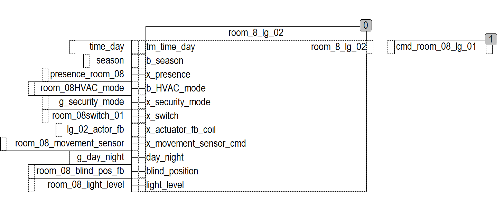
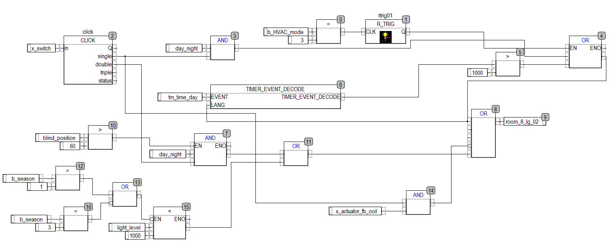
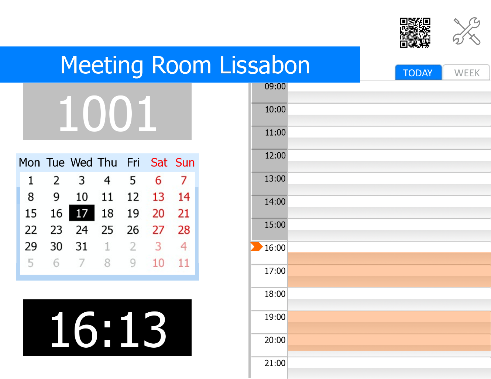

# KNXpartners

## Our team of experienced coders & software developers help you to grow up smart level of your installations

### WHAT

**KNXlevelUP** system is our know how: package of industrial PLC with software core Codesys in conjunction with visualization server [Iridium](http://iridi.com) with frontend and backend on JS code is a flexible and powerfull system with many features that can fulfill any wishes in automation.

### HOW
- industrial PLC enables us to create failsafe systems with increased reliability, which processes scenario logic with unlimited duration. PLC with KNX inteface is original KNX device give you advantage of KNX technology.

- [Iridium](http://iridi.com) visualization server in different hardware implementation enables us to create functionally and graphically tailor-made HMI, at the same time providing data firewall between KNX, Modbus TCP and AV/HTTP systems and allows to control any IP devices with multi-language interface. Also we build different task on it: BYOD, MS Exchange integration, security and control system.

### KEY FUNCTIONS
- **Business Rules Engine (BRE)** is KNXlevelUP module, which enables to separate all dependencies, procedures and scenarios into a standalone software or hardware module: simplifies and increases control quality of various modes and scenarios. _(in upcoming release planed for Q1 of 2019 machine learning is going to be incorporated in this module)_

     _all factors affected on everyone lightgroup should be collected in only one place. Here you see FB example of one rule for one lightgroup. Everyone lamp, blind, motor and etc should be done the same way._

     _the rules can be complicated, but the main aim is: one output_

- modular PLC is used as an interface between various engineering systems, which operate on different physical buses: KNX, DALI, Modbus, RS-485, LONbus, BACnet and others.

- logging system with collects, registers, stores and processes alarms and other events. Every one alarm or event have to recieve they own priority level. Single notifications system for all events thru the different ways.

- notifications through e-mail, SMS, SIP call, voice alarm (via multiroom system), Telegram chat via the telegram bot, system logging on remote syslog sever OR syslog server on user panel

- simplified procedure of system debugging for installers with logging in real time to Telegram-channel OR on user panel with visualization.

- **Bring Your Own Device (BYOD)** system is essential technology for residential and commercial spaces based on Iridium visualization. It enables use of visualization with limitations by roles and duration on any smartphone or tablets (for example, guest in a hotel room and use of conference room or mansions) on the fly. If you book meeting room, you can have visualization to control only this room during your reservation. Just scan QRcode

- **MS Exchange Server integration** - common solution in corporate segment for booking conference or meeting rooms from a doorsign touch panel or by e-mail. Can be used together with BYOD. Fully integrated in BMS, allows interaction with security service (for passing meeting persons to the building) or IT support & technical service for assistance.

     _doorsign screen touch panel for booking meeting room with extra functions_

- storage of data in either local or cloud database with mathematical processing of it.

- Ad hoc reports from stored data: analysis, charts, prediction.

- A lot of iRidium drivers for variety of device types: AV systems and receivers, projectors, TV, audio multiroom systems, SIP driver, fingerprint scanners and lot more AND also native drivers: KNX, Modbus,  HDL, SIP, Helvar, Crestron, AMX, BACNet.

- We keep developing drivers for new devices. We can also create drivers for any IP devices on demand, if it has published API.
-----------------------------------
*************************************

Also look at visu project its smart marketing obj to play with it & show it to your customer. Its work on real iRidium server for small or middle size projects. 

 You must use two devices: 1 smartphone for control virtual mansion & second device – tablet or PC / Mac for feedback visualization in real time. Both devices connect to virtualization server iRidium via real IP and work together.

On smartphone you will see example of design (in iOS style) with several rooms.
On the second panel will be reaction on you control.

### 1. Install iRidium i3pro app on a smart phone, tablet or PC:

- [i3 pro for iOS in AppStore](https://itunes.apple.com/us/app/i3-pro/id1039770224?l=ru&ls=1&mt=8)
- [i3 pro for Android in GooglePlay](https://play.google.com/store/apps/details?id=com.iridium.i3pro_v100)
- [i3 pro for Windows](http://www.iridiummobile.net/redirects/?go=iRidium_SETUP_PRO) - direct link to download from site iRidi: [https://iridi.com/download/software/v3/](https://iridi.com/download/software/v3/)

### 2. Open i3pro and authorize in it with credentials:
    login:                       checkvisu@knx.partners

    password:                    knxlevelup

### 3. Press “KNXpartners” folder and download the visualization project:
    for smartphone: “KNXpartner_Visu_Phone”

    for feedback screen: virtualScreen_TabletOrPC (its aprox 70MB, download take couple minutes)

example of control: [youtube_vurtualHouse_control](https://youtu.be/A2l571NroGU)